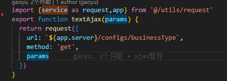
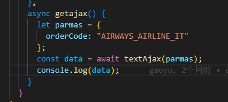
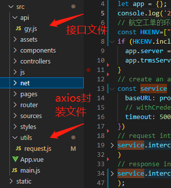
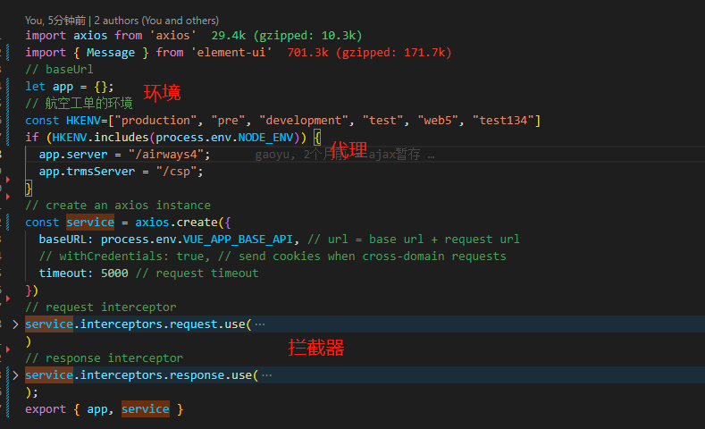
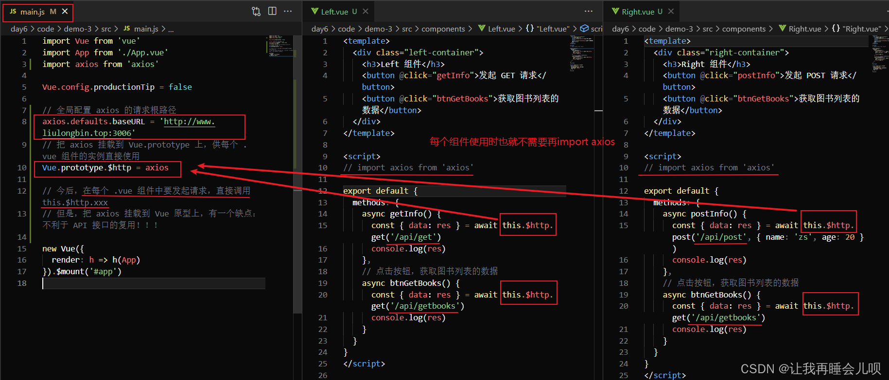

::: tip
客服工单系统-航空工单ajax请求封装优化方案。

:::
封装方案参考VUE-TEMPLATE-ADMIN

## 如何使用

## 框架架构图

## axios封装

## 架构优势分析

#### 开发角度
1.调用方式简单明了，减少页面冗余度。
2.复用性。
3.api统一管理，不管接口有多少，所有的接口都可以非常清晰，容易维护，通常我们的项目会越做越大，页面也会越来越多，如果页面非常的少，直接用axios也没有大的影响，那页面多了起来，上百个接口呢，这个时候后端改了个接口，多加一个参数什么的呢？那就只有找到那个页面，进去修改，整个过程很繁琐不易于项目的维护和迭代。

#### 运维角度
1.生产问题直接找接口，通过接口文件直接找页面，在大项目非高度复用接口情况下，比通过路由找页面更快。

#### 为什么不把axios挂载到vue实例上。
1.导致vue实例更大。
2.不能复用。
例如

