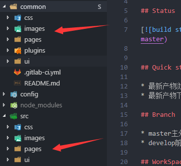

::: tip
TRP标准版合约服务于为航司B2C官网，低成本维护航司静态页-交付总部进行二次开发。

:::
合约航司包括：成都航空，北部湾航空，西藏航空，桂林航空，龙江航空，天骄航空。

## 项目链接

北部湾航空

https://www.gxairlines.com/

## 框架架构图

## 架构简介

项目使用git子仓库（common）进行公用组件开发
src下的为个性化开发目录
gulp打包会进行个性化覆盖common相同文件内容。

