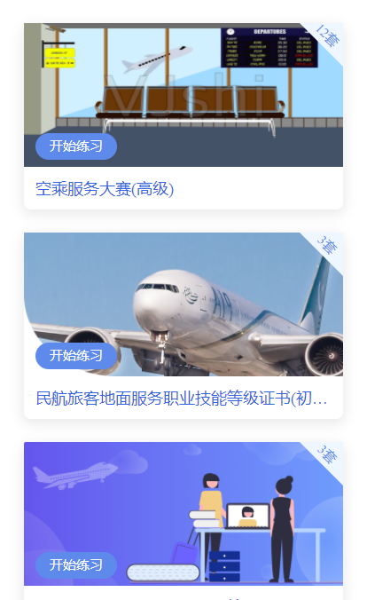
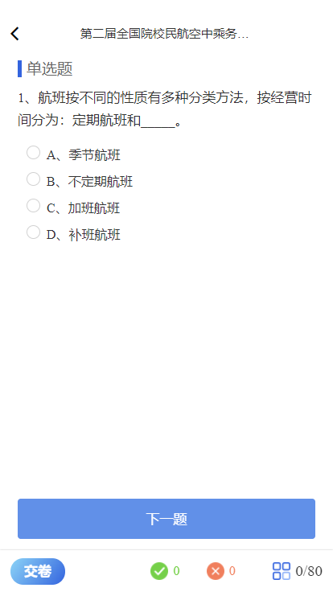

::: tip
 民航考试系统

:::

## X考试系统
项目链接：
https://exam.cata.org.cn:30091/#/login
## 项目技术
vue+elementui+sass+webpack

## 普通考试系统桌面端
项目架构：
基于普通考试系统web端进行electron套壳。

## 项目技术
vue+elementui+sass+webpack+electron

## 民航宝典（小程序）
### 项目预览：

## 项目技术
react+taro